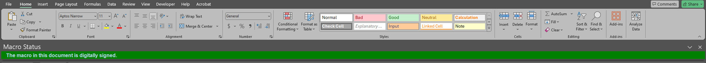
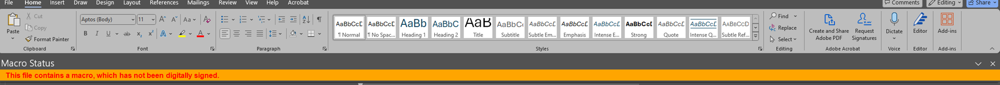
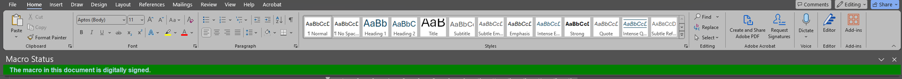

# Macro Polo #

-------------------

This add-in is design to detect if a file has a macro as its opened. 
If it does, it will show a message say if the macro has been digitally signed or not.

Example: 
Excel - unsigned: 

Excel - signed: 

Word - unsigned: 

Word - signed: 

